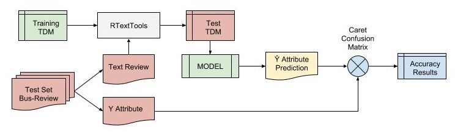

```{r setup, message=FALSE, warning=FALSE, cache=TRUE, echo=FALSE}
# loading the result dataset
load("./result/summary.rdata")
```

This is the report for the Capstone Project of the Coursera Data Science Specialization by Johns Hopkins Bloomberg School of Public Health.

## Introduction

In this study we will study the ability of the texts, in the Yelp's Reviews dataset [(Yelp Challenge, 2015)][@YELP], to be used to predict things business characteristics and attributes. For example, is it possible, through them, to predict the evaluation stars, if the establishment has free Wi-Fi, or have parking? There in the text comments, information about the price, if it is good for kids or groups? Comments about how noisy the environment is?

In addition, we will try to understand what would be the best approach for text prediction and what are the limitations of this technique in the Yelp's context? Has a model, trying to predict this business attributes enough accuracy to be considered useful? 

## Methods

### General Text Mining Approach

The classic textbook approach to Texting Mining is to create a *Corpus* of text to be preprocessed. In the pre process the text if *normalized* and *cleaned* transforming all words to lowercase, removing punctuation, extra whitespaces and even numbers, removing non-significant words, as *a, and, also, the, etc.* (it's known as *stop words*). In some case, the common word endings (e.g., “ing”, “es”, “s”) are removed also. This is referred to as “stemming” documents. We stem the documents so that a word will be recognizable to the computer, despite whether or not it may have a variety of possible endings in the original text.

After this process is created a Term Document Matrix, or TDM [(Feinerer, 2005)][@Feinerer], that is a sparse matrix that counts the occurrence of all unique words found in text corpus for each document in corpus. Therefore, the TDM characterizes each document, so it can be used as features to be analyzed or as input in machine learning algorithms trying to predict aspects to the object associated to the text or the text itself.

A great description of the process above, using R, can be seen in this [online tutorial](https://rstudio-pubs-static.s3.amazonaws.com/31867_8236987cf0a8444e962ccd2aec46d9c3.html).

### Business Attributes Predictive Analysis Workflow

The method to study the predictive capability of a text from Yelp `Review` tells us things about an `Business` attributes: (1) for each `Business` attribute of interrest, try to fit a model using the TDM of a subset from text in `Reviews` for that Business. After that, (2) use this model to try to predict the attribute from other text Review subset. So basically what we did was to test several machine learning algorithms accuracy in use the TDM of text `Reviews` to predic several `Business` attribute.

A diagram showind the first step (1) can be seen in the image below, the `Business` Yelp dataset is preprocessed to transform and prepare the attributes to be used in the fitting process (transform them in factors, converting the `NA` values in an `unknown` value, merging some scales to reduce the dimensionality, etc.). After this, the `Business` dataset is merged with the `Review` dataset, so for each text `Review` now has the attributes values to which the text refers. This `Business-Review` dataset is separated in **Training** and **Test** datasets using [Caret][@CARET] CreateDataPartition function. The **Training** dataset's text is processed using the [RTextTools][@RTextTools] package to extract the TDM, and to fit a model to a specific `Business` attribute.


In the second step (2) the accuracy of the model generated is verified using the `Business-Review` Test dataset. This is done creating another *TDM* for the text, but containing the same words present in the *Training TDM*. This is necessary because the model was trained in the *training glossary* so the *Test TDM* must have the same words. The *RTextTool's create_matrix* function can take another TDM as input to keep the glossary the same. After that, the model fitted in the first step is used to predict the attribute value, and the output is confronted with the real value. The accuracy (and others performance value) is measured using the *Caret's confusionMatrix* function.



### Source Code

As said, for the analysis we use the [RTextTools][@RTextTools] package that provides text-mining infrastructure for machine learning analysis, also used the [Caret][@Caret] package to sample and split the dataset and analyses the accuracy. For KNN and Naive Bayes algorithms, we use the [e1071][@e1071] package.

```{r sampleCode, eval=FALSE}
# example how RTextTools create the TDM, Learning Containers and Predict Results
trainMatrix <- create_matrix(train$text)
predMatrix <- create_matrix(test$text,originalMatrix=trainMatrix)

# RTextTools ML containers
traincontainer <- create_container(trainMatrix, train$y, 
                            trainSize=1:train_sample_size, virgin=F)
predContainer <- create_container(predMatrix, test$y, 
                            testSize=1:test_sample_size, virgin=F)

# Train Model
mod <- train_model(container=trainCont, algorithm="SVM", ]
                    kernel="linear", cost=1)

# Predict 
y_hat <- classify_model(predCont,mod)[[1]]
```

You can see all the code and analysis at [github][@github], the repository tells the code structure and organization, also the basic instruction to run de code.

### Algorithms and Business Attributes

For time and resources limitations (mainly process power and memory size), for this study we choose analyze the performance of the following machine learning algorithms: [Support Vector Machine (SVM)](https://en.wikipedia.org/wiki/Support_vector_machine), [Maximum Entropy Classifier (MAXENT)](https://en.wikipedia.org/wiki/Multinomial_logistic_regression), [Decision Tree Learning (TREE)](https://en.wikipedia.org/wiki/Decision_tree_learning), [Random Forest](https://en.wikipedia.org/wiki/Random_forest), [K-nearest neighbors (KNN)](https://en.wikipedia.org/wiki/K-nearest_neighbors_algorithm) and [Naive Bayes Classifier (NAIVEBAYES)](https://en.wikipedia.org/wiki/Naive_Bayes_classifier). Aurangzeb Khan [(Khan, A. 2010)][@KHAN2010] write an excellent article about these algorithms in the context of text classifying.

The `Business` attributes selected for the study can be seen in the table below. They was first preprocessed to transform its values in factors and be ready to be used as categories in the ML Classifiers. The `NA values` was reclassified as `unknown` to be processed. Also we do some exercises reducing the number of class of some attributes, for example, the for the `star review` we also create an `emotional attribute` reclassifying the reviews with 1 and 2 stars in "negative", and the reviews with 4 and 5 stars in "positive" (and removing reviews from 3 stars). Details of each attribute transformation can be seen at source code. This was made because text classifiers notoriously works better with fewer classes and with extreme values.

```{r featureNames, echo=FALSE, cache=TRUE}
data <-  fitSummary[fitSummary$cycle.name=="attribute.analysis" &
                      fitSummary$algorithm=="MAXENT" &
                      fitSummary$business.category=="Restaurants" &
                      fitSummary$term.size > 10000,
                    c("feature.name","classification.names","classification.levels")]

names(data) <- c("Attributes","Classification Values","Number of Classes")
knitr::kable(unique(data),row.names=F)
```

## Results

### Analysis Dataset

After pre-processing the `Business` dataset, se select the ten most frequent business category present in the data, we keep the following:

```{r businessCategories, echo=FALSE}
# loading business preprocessed dataset used in the analysis
load('./data/business.rdata')
summary(business$category)
```

After the merging we stand with 1.1 million `Business-Review` register, to keep the loading time and memory allocated size under control we sampled 500 thousand of Business-Review registers to be used in the analysis.

### Algorithms Analysis

To check the performance (accuracy and time-consuming resources), we confront the chosen algorithms in a simplified classification test. The task is to classify if a `Review` (*reviewEmotion* attribute) are `positive` or `negative` from `Restaurants` category only, here are the Accuracy Results by the number of terms in the Term Document Matrix.

```{r plotAccuracy, echo=FALSE, warning=FALSE, message=FALSE, fig.height=4,fig.width=6}
# subset the results to take only the accuracy study
data <- fitSummary[fitSummary$cycle.name=="algorithm.selection" & 
                     fitSummary$term.size < 15000,]

# plot accuracy by term.size grouped by algorithm
library(ggplot2)
g <- ggplot(data=data, aes(x=term.size, y=accuracy, group=algorithm, colour=algorithm)) 
g <- g + geom_smooth(method="auto",se=F) + geom_point(aes(shape=algorithm), size=2) + theme_bw()
g <- g + ggtitle(paste("Accuracy - Emotional Analysis"))

g

```

We can see that, for this kind of problem, the SVM, MAXENT and RF algorithms has the best accuracy with values around 85% after 10000 terms in TDM. We also can note that the accuracy stabilizes next 15000 terms. We analyzes the total time to train and predict each test, see below.

```{r plotPerformance, echo=FALSE, warning=FALSE, message=FALSE, fig.height=4,fig.width=6}
# Subset the results to take only the performance study
data <- fitSummary[fitSummary$cycle.name=="algorithm.selection" & 
                     fitSummary$term.size < 15000,]

# sum the total time for analysis
data$total.time <- data$time.tdm + data$time.train + data$time.pred

# in KNN algorithm Train and Prediction are done at same step
data[data$algorithm=="KNN",]$total.time <- data[data$algorithm=="KNN",]$total.time -
  data[data$algorithm=="KNN",]$time.pred

# plots the total time by term size
q <- ggplot(data=data, aes(x=term.size, y=total.time, group=algorithm, colour=algorithm)) 
q <- q + geom_smooth(method="auto",se=F) + geom_point(aes(shape=algorithm), size=2) + theme_bw()
q <- q + ggtitle(paste("Total Execution Time - Emotional Analysis"))
q

```

The **TREE**, **SVM** and **MAXENT** algorithms have less time consuming, so taking accuracy and performance as selection criteria, we choose perform the predictive analysis of remaining attributes using only **SVM** and **MAXENT** algorithms.

### Predictive Capability of Business Attributes

For each of the attribute select to the study, and for each of the algorithms we perform the accuracy study, first removing the `unknown` values and after with the `unknown` values. Beside this, each study was applying once to the *Restaurant* category only and after to *All* categories in the study dataset (We hypothesized that the `Review` text glossary for one category is different for other category). 

Also, for each attributed analyzed, we eliminate the prevalence effect in the samples, i.e., we balance to equal numbers of the classes to a specific attribute. For example, the `smoking` attribute in the `Business_Review` dataset has around 95000 samples with value `NO`, 117000 samples with `Unknown` and 287000 with `Yes` value, so to avoid the fitted model guess more `Yes` and be more right then wrong, we balance  the training and test samples to have equals numbers (95000, the lowest number) of `No`, `Unknown` and `Yes` values. 

After applying the Accuracy test, several times, trying to predict the attributes using SVM and MAXENT algorithms to a Term Document Matrix with more than 15000 terms, of balanced `Business-Review` samples, and take an average, we show bellow the results of the prediction that achieve **more than 60% of accuracy**, ordered decreasingly by the MAXENT accuracy.

```{r resultTable, echo=FALSE, message=FALSE, warning=FALSE}

# selecting only data from attributes study
columns <- c("feature.name","classification.levels","business.category",
             "algorithm","accuracy")

data <-  fitSummary[fitSummary$cycle.name=="attribute.analysis.400kdataset" & 
                      fitSummary$term.size > 20000,columns]

# reshaping the dataframe to put Accuracy of SVM and MAXENT side by side
library(reshape2)
d <- melt(data, id=columns[1:4])
f <- paste(paste(columns[1:3],collapse="+"),columns[4],sep="~")
d <- dcast(d, as.formula(f) , mean)
d <- d[d$MAXENT>0.6,]

# sorting
library(dplyr)
data <- dplyr::arrange(d, desc(MAXENT), desc(SVM))

# generating a table
options(digits=4)

names(data) <- c("Attribute", "Classes", "Business Category", "SVM","MAXENT")

knitr::kable(data,row.names=T)
```

## Discussion

### Conclusions

Looking to the algorithm performance analysis made for the `reviewEmotion` attribute of `Restaurants`, we can verify

1. The algorithms studied has different accuracy, and Random Forest, Support Vector Machine and Maximum Entropy has similar and better results.
1. The performance of these algorithms is attached to the great number of features (the terms in the TDM) and sample size (around 1.1 million of `Review` text available to train them).
1. The accuracy increases with the number of terms used as algorithm input in the TDM, but stabilizes after 15000 terms.
1. The three algorithm has different processing times, so for this kind of problem is important to balance the number of terms, the precision desired and the computer processing power available. In your study we concluded that using MAXENT with enough samples that generate around 15000 to 20000 terms in the TDM, are good parameters for the study of predictive capability of text `Reviews`. 

We can see, in the results table, the following interesting results:

1. The Maximum Entropy (MAXENT) algorithm has a slight better accuracy than SVM.
1. The text `Review` in Yelp database has a good signal (or information enough) to prediction *the emotion of a review* (see results #1 and #2 of reviewEmotion attribute) with accuracy from 0.86 to 0.88, independently of business category.
1. Users also seems to comment in the reviews information about the smoking status (result #3) and the business Price Range (results #4 and #5) because the models can predict the information with more than 0.75 of accuracy.
1. Surprisingly the information about `goodForKids` in `Restaurants` (study # 6) is present in the review texts, while information about Parking (#18) and Wi-Fi (didn't appears in the results because has accuracy less than 0.6) aren't in the text reviews.
1. We hypothesized that the glossary in the reviews differs from a category to other (seems reasonable), but the category information affect the results in distinctive ways. Attributes like `reviewEmotion` and `goodForSmoking` are better predicting ignoring the business category, while `goodForKids` and `hasParking` seems better when only the category `Restaurant` is selected. Therefore, a Machine Learning Classifier has to take in account the Business Category as one of the feature or input, to do better predictions.
1. In general, when the model is trying to classify the text in two extreme classes (when it has to decide only between two values), it has better accuracy than when has to classify in three or more classes. See the `noisy` attribute (#11) with two classes, it was better than when it considers the `unknown` class (#13). The original attribute `noise level` with four levels (five levels with `NA`) has failed to appears in the table, i.e., has accuracy below the 0.60.

### Further analysis

Some extra analysis can be applied to this study:

1. With more time and computational power others algorithms could be test. It would be interesting see the performance of Neural Networks (GLMNET and NNET), Gradient Boosting Machine, Bootstrap Aggregating and Latent Dirichlet Allocation (LDA/SLDA).
2. There are information about Emotion, Smoking, Price Range and *suitable* for kids in the text reviews, this study didn't try makes a predicting algorithm for this features, but the existence of the signal appears to indicate that is possible combine text and other characteristics to predict this business attributes.
3. We eliminate the prevalence effect because we are interested only in the Text Predictive Capability, but adding this information back it would be possible make an analysis of Machine Learning classifiers using True Table (True Positives, False Positives, etc.) values and AUC (Area Under the Curve), to define if a business attribute can be, indeed, predicted by Yelp `Review` information.

## References

[@YELP]: http://www.yelp.com/dataset_challenge
* **Yelp Challenge, 2015**: http://www.yelp.com/dataset_challenge

[@Feinerer]: https://cran.r-project.org/web/packages/tm/vignettes/tm.pdf
* **Feinerer, 2005**: Feinerer, I. 2005 - Introduction to the tm Package Text Mining in R - CRAN, July 3, 2015

[@RTextTools]: https://cran.r-project.org/web/packages/RTextTools/index.html

* **RTextTools**: Automatic Text Classification via Supervised Learning - https://cran.r-project.org/web/packages/RTextTools/index.html - CRAN

[@CARET]: https://cran.r-project.org/web/packages/caret/index.html
* **Caret**:  Classification and Regression Training - https://cran.r-project.org/web/packages/caret/index.html - CRAN

[@e1071]: https://cran.r-project.org/web/packages/e1071/index.html
* **e1071**: Misc Functions of the Department of Statistics, Probability Theory Group (Formerly: E1071), TU Wien - https://cran.r-project.org/web/packages/e1071/index.html - CRAN

[@github]: https://github.com/GiulSposito/DSS-Capstone

* **GitHub**: Data Science Specialization Capstone Project Source Code repository: https://github.com/GiulSposito/DSS-Capstone

[@KHAN2010]: http://www.jait.us/uploadfile/2014/1223/20141223050800532.pdf

* **Khan, A. 2010**: Khan, A., Baharudin, B., Lee, L., A Review of Machine Learning Algorithms for Text-Documents Classification - JOURNAL OF ADVANCES IN INFORMATION TECHNOLOGY, VOL. 1, NO. 1, FEBRUARY 2010
