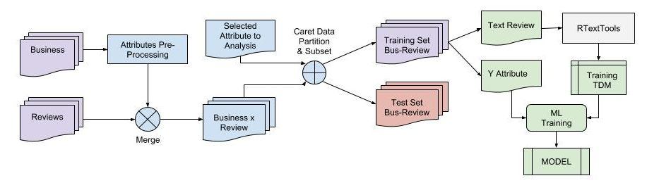

Predictive Capability of Text Mining in Yelp Reviews
========================================================
author: Giuliano Sposito
date: November, 2015

This is the presentation for the Capstone Project of the Coursera Data Science Specialization by Johns Hopkins Bloomberg School of Public Health.

Introduction
========================================================

In this study we will study the ability of the texts, in the Yelp's Reviews dataset ([Yelp Challenge, 2015](http://www.yelp.com/dataset_challenge)), to be used to predict things business characteristics and attributes.

For this analysis we use the [RTextTools](https://cran.r-project.org/web/packages/RTextTools/index.html) package that provides text-mining infrastructure for machine learning analysis, also used the [Caret](https://cran.r-project.org/web/packages/caret/index.html) package to sample and split the dataset and analyses the accuracy.

Algorithms Performance
========================================================

***

Results (Accuracy > 0.7)
========================================================

|   |Attribute      | Classes|Business Category |    SVM| MAXENT|
|:--|:--------------|-------:|:-----------------|------:|------:|
|1  |reviewEmotion  |       2|all               | 0.8735| 0.8808|
|2  |reviewEmotion  |       2|Restaurants       | 0.8697| 0.8788|
|3  |goodForSmoking |       2|all               | 0.7797| 0.7890|
|4  |pricy          |       2|Restaurants       | 0.7805| 0.7860|
|5  |pricy          |       2|all               | 0.7437| 0.7527|
|6  |goodForSmoking |       2|Restaurants       | 0.7330| 0.7406|
|7  |goodForKids    |       2|Restaurants       | 0.7252| 0.7330|
|8  |goodForKids    |       2|all               | 0.7180| 0.7205|
|9  |pricy          |       3|all               | 0.7117| 0.7163|
|10 |smoking        |       3|all               | 0.6937| 0.7037|

Discussion
========================================================

1. The text `Review` in Yelp database has a good signal (or information enough) to prediction *the emotion of a review* (see results #1 and #2 of reviewEmotion attribute) with accuracy from 0.86 to 0.88, independently of business category.
1. Users also seems to comment in the reviews information about the smoking status (result #3) and the business Price Range (results #4 and #5) because the models can predict the information with more than 0.75 of accuracy.
1. Surprisingly the information about `goodForKids` in `Restaurants` (study # 6) is present in the review texts, while information about Parking and Wi-Fi (didn't appears in the results because has accuracy less than 0.7) aren't in the text reviews.

